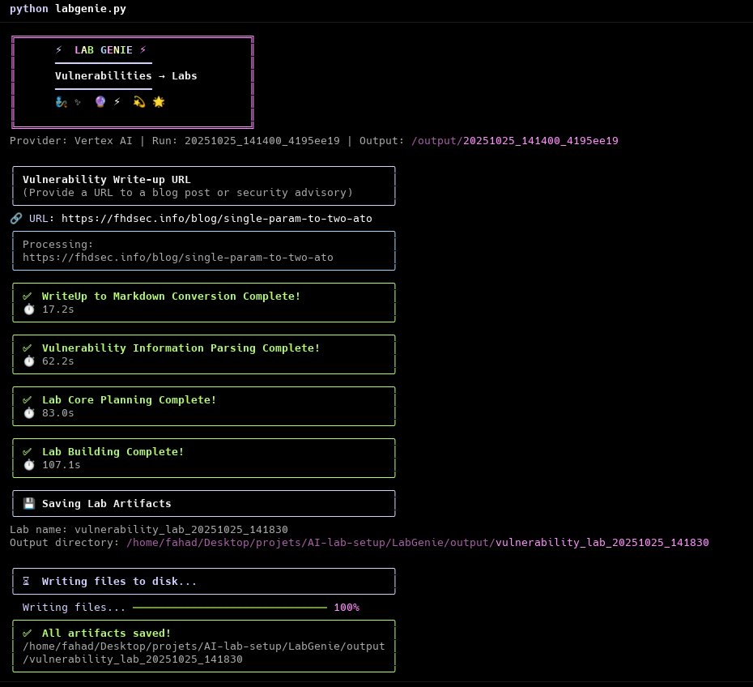

# LabGenie - Vulnerability Lab Generator

**Transform vulnerability write-ups into fully functional, runnable security labs**

LabGenie is a terminal-first, interactive CLI tool that takes a vulnerability write-up URL and produces a complete, runnable lab environment ready for security research and education.

---

## Quick Start



### Prerequisites

- Python 3.10 or higher
- **Option A**: Google Gemini API key ([Get one here](https://makersuite.google.com/app/apikey)) - **Recommended**
- **Option B**: Google Cloud Project with Vertex AI enabled

### Installation

1. **Clone or navigate to this directory**

```bash
cd /path/to/LabGenie
```

2. **Run the setup script**

```bash
bash setup.sh
```

This will:
- Create a Python virtual environment
- Install all dependencies
- Check for required API keys
- Make the CLI executable

3. **Configure your AI provider**

**Option A: Gemini API (Recommended)**
```bash
export GOOGLE_API_KEY='your-gemini-api-key'
```

**Option B: Vertex AI (Enterprise)**
```bash
export GOOGLE_CLOUD_PROJECT='your-gcp-project-id'
gcloud auth application-default login
```

Or create a `.env` file:
```bash
cp .env.example .env
# Edit .env and add your API key
```

### Run LabGenie

```bash
# Activate virtual environment (if not already active)
source venv/bin/activate

# Interactive mode (default)
python labgenie.py

# Direct URL mode
python labgenie.py --url https://example.com/vuln-writeup

# Debug mode for detailed output
python labgenie.py --debug
```

---

## Usage

Simply run the CLI and provide a vulnerability write-up URL:

```bash
$ python labgenie.py

🔗 Write-up URL: https://example.com/blog/sqli-vulnerability
```

The CLI will then:

1. **Convert** the write-up to structured markdown
2. **Parse** vulnerability information and reproduction steps  
3. **Plan** the lab architecture and components
4. **Build** complete, runnable lab artifacts

### Output

All generated files are saved to `./output/{labname}/`:

```
output/
└── sqli_vulnerability_lab/      # Lab name extracted from vulnerability
    ├── lab_manifest.json         # Complete lab metadata
    ├── README.md                 # Lab setup instructions
    ├── docker-compose.yml        # Container orchestration
    └── src/                      # Application source code
```

The lab output dir name can be passed via --output-dir flag.
---

## Architecture

LabGenie implements a four-stage AI agent workflow.
For detailed information about the system architecture, agent designs, and technical implementation, see:

** [docs/Architecture.md](docs/Architecture.md)**

---

## Documentation

- **[Architecture](docs/Architecture.md)** - System design and agent workflow
- **[Troubleshooting](docs/Troubleshooting.md)** - Common issues and solutions

---

## Contributing

Contributions are welcome!

---

## Acknowledgments

LabGenie is inspired by the paper [**From CVE Entries to Verifiable Exploits**](https://arxiv.org/pdf/2509.01835). Shoutout to the researchers at **UC Santa Barbara** who created it—it's a wonderful multi-agent framework that generates **POC** code from **CVE** entries. Their approach inspired LabGenie, which tackles a related challenge from a different angle. Huge thanks to the contributors of the whitepaper for lighting the way.

---

**Made with 🧞 magic by LabGenie**
