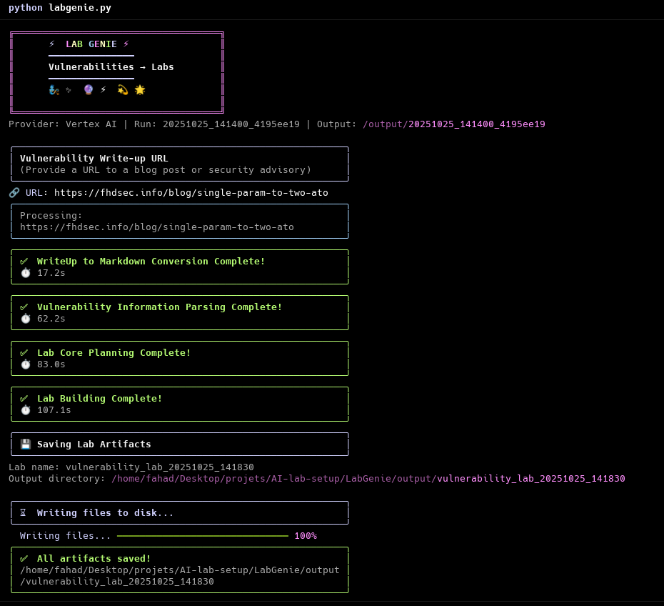

# LabGenie - Vulnerability Lab Generator

**Transform vulnerability write-ups into fully functional, runnable security labs**

LabGenie is a terminal-first, interactive CLI tool that takes a vulnerability write-up URL and produces a complete, runnable lab environment ready for security research and education.

---

## Quick Start



### Prerequisites

- Python 3.10 or higher
- One of the following AI providers (in recommended order):
  - **Option A**: Claude Code subscription — `claude login` *(no API costs)*
  - **Option B**: Anthropic API key from [console.anthropic.com](https://console.anthropic.com/)
  - **Option C**: Google Gemini API key
  - **Option D**: Google Cloud Project with Vertex AI enabled

### Installation

1. **Clone or navigate to this directory**

```bash
cd /path/to/LabGenie
```

2. **Run the setup script**

```bash
bash setup.sh
```

This will:
- Create a Python virtual environment
- Install all dependencies
- Detect your configured AI provider automatically
- Make the CLI executable

3. **Configure your AI provider**

**Option A: Claude Code subscription (Recommended — no API costs)**
```bash
# Install Claude Code from https://claude.ai/download, then:
claude login
```
LabGenie detects the `claude` CLI automatically — no environment variables needed.

**Option B: Claude API**
```bash
export ANTHROPIC_API_KEY='your-anthropic-api-key'
```
> **Note:** This is a separate pay-per-use key from [console.anthropic.com](https://console.anthropic.com/), not your Claude.ai subscription.

**Option C: Gemini API**
```bash
export GOOGLE_API_KEY='your-gemini-api-key'
```

**Option D: Vertex AI (Enterprise)**
```bash
export GOOGLE_CLOUD_PROJECT='your-gcp-project-id'
gcloud auth application-default login
```

Or create a `.env` file:
```bash
cp .env.example .env
# Edit .env and add your credentials
```

### Run LabGenie

```bash
# Activate virtual environment (if not already active)
source venv/bin/activate

# Interactive mode — auto-detects your provider
python labgenie.py

# Direct URL mode
python labgenie.py --url https://example.com/vuln-writeup

# Build from local markdown file(s) — skips URL fetch
python labgenie.py --file writeup.md
python labgenie.py --file part1.md part2.md

# Resume a failed run (auto-detects last successful step)
python labgenie.py --resume 20260620_224245_d7d94b89

# Explicitly choose a provider
python labgenie.py --url https://example.com/vuln --provider claude-code
python labgenie.py --url https://example.com/vuln --provider claude
python labgenie.py --url https://example.com/vuln --provider gemini
python labgenie.py --url https://example.com/vuln --provider vertex

# Debug mode for detailed output
python labgenie.py --debug
```

---

## Provider Comparison

| Provider | Cost | Setup | Best For |
|---|---|---|---|
| `claude-code` | Covered by Claude Max subscription | `claude login` | Most users — zero API costs |
| `claude` | Pay-per-token (Anthropic API) | `ANTHROPIC_API_KEY` | CI/CD, scripted runs |
| `gemini` | Pay-per-token (Google API) | `GOOGLE_API_KEY` | Google ecosystem users |
| `vertex` | Pay-per-token (GCP) | GCP project + ADC | Enterprise / GCP users |

**Auto-detection priority:** `claude-code` → `claude` → `vertex` → `gemini`

---

## Usage

### From a URL

```bash
$ python labgenie.py --url https://example.com/blog/sqli-vulnerability
```

### From local markdown files

Skip the URL fetch step entirely by passing one or more local `.md` files:

```bash
python labgenie.py --file writeup.md
python labgenie.py --file part1.md part2.md
```

In interactive mode, just type a file path instead of a URL at the prompt — LabGenie detects it automatically.

### Resuming a failed run

If a run fails midway (e.g. the builder agent times out), resume it without re-running the successful steps:

```bash
# Use the run_id printed in the banner, or the full log directory path
python labgenie.py --resume 20260620_224245_d7d94b89
python labgenie.py --resume ./logs/20260620_224245_d7d94b89

# If the markdown step also needs re-seeding, combine with --file
python labgenie.py --resume 20260620_224245_d7d94b89 --file writeup.md
```

LabGenie reads the log files from the previous run, auto-detects the first step that failed or didn't complete, and re-runs only from that point.

---

The four-stage workflow:

1. **Convert** — fetch and parse the write-up into structured markdown *(skipped with `--file`)*
2. **Parse** — extract vulnerability details and reproduction steps
3. **Plan** — design the lab architecture and components
4. **Build** — generate complete, runnable lab artifacts

### Output

All generated files are saved to `./output/{labname}/`:

```
output/
└── sqli_vulnerability_lab/      # Lab name extracted from vulnerability
    ├── lab_manifest.json         # Complete lab metadata
    ├── README.md                 # Lab setup instructions
    ├── docker-compose.yml        # Container orchestration
    └── src/                      # Application source code
```

The lab output dir name can be passed via `--output` flag.

---

## Architecture

LabGenie implements a four-stage AI agent workflow.
For detailed information about the system architecture, agent designs, and technical implementation, see:

**[docs/Architecture.md](docs/Architecture.md)**

---

## Documentation

- **[Architecture](docs/Architecture.md)** - System design and agent workflow
- **[Troubleshooting](docs/Troubleshooting.md)** - Common issues and solutions

---

## Contributing

Contributions are welcome!

---

## Acknowledgments

LabGenie is inspired by the paper [**From CVE Entries to Verifiable Exploits**](https://arxiv.org/pdf/2509.01835). Shoutout to the researchers at **UC Santa Barbara** who created it—it's a wonderful multi-agent framework that generates **POC** code from **CVE** entries. Their approach inspired LabGenie, which tackles a related challenge from a different angle. Huge thanks to the contributors of the whitepaper for lighting the way.

---

**Made with 🧞 magic by LabGenie**
