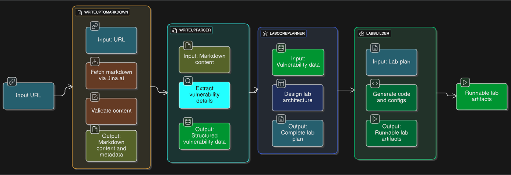

# LabGenie Architecture


## Agent Details

### 1. WriteUpToMarkdown Agent

**Purpose**: Convert vulnerability write-up URLs to markdown and validate content type.

**Location**: `agents/WriteUpToMarkdown/agent.py`

**Model**: `gemini-2.5-flash` (lightweight, fast for content validation)

**Configuration**:
- Temperature: 0.4 (consistent validation decisions)
- Top P: 0.9
- Top K: 40

**Process**:
1. Receives a URL as input
2. Fetches content via Jina.ai (`https://r.jina.ai/{url}`)
3. Validates if content is a vulnerability write-up
4. Returns structured JSON with:
   - `status`: "ok" or "error"
   - `markdown`: Full markdown content
   - `input`: URL and fetch metadata
   - `error`: Error details if applicable

### 2. WriteupParser Agent

**Purpose**: Extract structured vulnerability information from markdown content.

**Location**: `agents/WriteupParser/agent.py`

**Model**: `gemini-2.5-pro` (precise information extraction)

**Process**:
1. Receives markdown content
2. Extracts vulnerability details:
   - Title and description
   - CVE identifiers
   - Affected software/versions
   - Vulnerability type
   - Attack vectors
   - Severity
   - References
3. Returns structured vulnerability data

### 3. LabCorePlanner Agent

**Purpose**: Design complete lab architecture from vulnerability data.

**Location**: `agents/LabCorePlanner/agent.py`

**Model**: `gemini-2.5-pro` (complex planning and architecture)

**Process**:
1. Receives structured vulnerability data
2. Designs lab components:
   - Application architecture
   - Database schema
   - Docker configuration
   - Network topology
3. Returns comprehensive lab plan with:
   - File structure
   - Technology stack
   - Setup instructions

### 4. LabBuilder Agent

**Purpose**: Generate complete, runnable lab artifacts from the plan.

**Location**: `agents/LabBuilder/agent.py`

**Model**: `gemini-2.5-pro` (code generation)

**Process**:
1. Receives lab plan
2. Generates all required files:
   - Application source code
   - Docker configurations
   - Database schemas
   - Documentation
3. Returns structured file list with:
   - `path`: File path
   - `content`: Full file content
   - `type`: File type
   - `description`: File purpose

**Docker Strategy**:
- **Multiple containers**: Generates `docker-compose.yml` for orchestrating multiple services (e.g., app + database + cache)
- **Single container**: Generates a single `Dockerfile` for standalone applications

## Base Agent Class

**Location**: `agents/base_agent.py`

**Purpose**: Provides common functionality for all agents.

**Key Features**:

1. **Multi-Provider Support**:
   - Gemini API (via `google-generativeai`)
   - Vertex AI (via `google-cloud-aiplatform`)
   - Auto-detection based on environment variables

2. **Prompt Management**:
   - Loads system instructions from markdown files
   - Each agent has its own prompt template
   - Supports dynamic prompt composition

3. **JSON Generation**:
   - `generate_json()` method with retry logic
   - Automatic JSON cleaning and repair
   - Handles markdown code fences
   - Repairs common JSON errors (trailing commas, unquoted keys)

4. **Error Handling**:
   - Detailed error logging to `logs/agent_errors/`
   - Retry mechanism (up to 3 attempts)
   - Descriptive error messages

5. **Response Parsing**:
   - Cleans markdown code blocks
   - Repairs malformed JSON
   - Extracts JSON from mixed content
   - Detailed error reporting with full payloads

## Configuration System

**Location**: `config.json`

**Structure**:
```json
{
  "models": {
    "WriteUpToMarkdown": "gemini-2.5-flash",
    "WriteupParser": "models/gemini-2.5-pro",
    "LabCorePlanner": "models/gemini-2.5-pro",
    "LabBuilder": "models/gemini-2.5-pro"
  }
}
```


## Logging System

### File Logger

**Location**: `logs/{run_id}/`

**Files**:
- `step_1_markdown_conversion.json`
- `step_2_vulnerability_parsing.json`
- `step_3_lab_planning.json`
- `step_4_lab_building.json`

**Purpose**: Debug and audit trail for each run.


### Model Selection Strategy

- **gemini-2.5-flash**: Fast, lightweight tasks (URL validation)
- **gemini-2.5-pro**: Complex tasks (parsing, planning, building)
