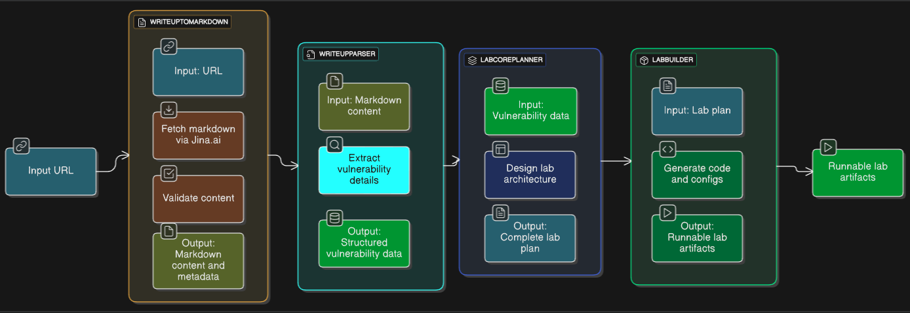

# LabGenie Architecture



## Supported Providers

LabGenie supports four AI backends, auto-detected in priority order:

| Provider | How it works | Key |
|---|---|---|
| `claude-code` | Shells out to the `claude` CLI — uses your **Claude Code subscription** | None (login via `claude login`) |
| `claude` | Anthropic Python SDK (`anthropic` package) | `ANTHROPIC_API_KEY` |
| `gemini` | Google Generative AI SDK | `GOOGLE_API_KEY` |
| `vertex` | Vertex AI SDK via `google-cloud-aiplatform` | `GOOGLE_CLOUD_PROJECT` + ADC |

Set `LABGENIE_PROVIDER` or pass `--provider` to override auto-detection.

---

## Agent Details

### 1. WriteUpToMarkdown Agent

**Purpose**: Convert vulnerability write-up URLs to markdown and validate content type.

**Location**: `agents/WriteUpToMarkdown/agent.py`

**Models by provider**:
- `claude-code` / `claude`: `claude-haiku-4-5` (fast, lightweight)
- `gemini` / `vertex`: `gemini-2.5-flash`

**Configuration**:
- Temperature: 0.4 (consistent validation decisions)
- Max tokens: 15 000

**Process**:
1. Receives a URL as input
2. Fetches content via Jina.ai (`https://r.jina.ai/{url}`)
3. Validates if content is a vulnerability write-up
4. Returns structured JSON with `status`, `markdown`, `input`, and optional `error`

---

### 2. WriteupParser Agent

**Purpose**: Extract structured vulnerability information from markdown content.

**Location**: `agents/WriteupParser/agent.py`

**Models by provider**:
- `claude-code`: `claude-sonnet-4-6`
- `claude`: `claude-opus-4-8`
- `gemini` / `vertex`: `gemini-2.5-pro`

**Process**:
1. Receives markdown content
2. Extracts: title, description, CVE IDs, affected software, vulnerability type, attack vectors, severity, references
3. Returns structured vulnerability data JSON

---

### 3. LabCorePlanner Agent

**Purpose**: Design complete lab architecture from vulnerability data.

**Location**: `agents/LabCorePlanner/agent.py`

**Models by provider**:
- `claude-code`: `claude-sonnet-4-6`
- `claude`: `claude-opus-4-8`
- `gemini` / `vertex`: `gemini-2.5-pro`

**Process**:
1. Receives structured vulnerability data
2. Designs: application architecture, database schema, Docker configuration, network topology
3. Returns comprehensive lab plan with file structure, technology stack, and setup instructions

---

### 4. LabBuilder Agent

**Purpose**: Generate complete, runnable lab artifacts from the plan.

**Location**: `agents/LabBuilder/agent.py`

**Models by provider**:
- `claude-code`: `claude-sonnet-4-6`
- `claude`: `claude-opus-4-8`
- `gemini` / `vertex`: `gemini-2.5-pro`

**Process**:
1. Receives lab plan
2. Generates all required files: source code, Docker configs, schemas, docs
3. Returns structured file list with `path`, `content`, `type`, `description`

**Docker Strategy**:
- Multiple containers → `docker-compose.yml`
- Single container → `Dockerfile`

---

## Base Agent Class

**Location**: `agents/base_agent.py`

**Key Features**:

1. **Multi-Provider Support** — four backends with auto-detection
2. **Prompt Management** — loads system instructions from per-agent `prompt.md` files
3. **JSON Generation** — `generate_json()` with retry logic, automatic cleaning, and repair
4. **Error Handling** — detailed logging to `logs/agent_errors/`, up to 3 retries
5. **Response Parsing** — cleans markdown fences, repairs malformed JSON, extracts from mixed content

### Provider dispatch in `generate()`

```
provider == "vertex"      → vertexai.GenerativeModel.generate_content()
provider == "claude-code" → subprocess: claude -p <prompt> --output-format json
provider == "claude"      → anthropic.Anthropic().messages.create()
provider == "gemini"      → genai.GenerativeModel.generate_content()
```

---

## Configuration System

**Location**: `config.json`

Provider-scoped model configuration:

```json
{
  "provider": "claude-code",
  "models": {
    "claude-code": {
      "WriteUpToMarkdown": "claude-haiku-4-5",
      "WriteupParser": "claude-sonnet-4-6",
      "LabCorePlanner": "claude-sonnet-4-6",
      "LabBuilder": "claude-sonnet-4-6"
    },
    "claude": {
      "WriteUpToMarkdown": "claude-haiku-4-5",
      "WriteupParser": "claude-opus-4-8",
      "LabCorePlanner": "claude-opus-4-8",
      "LabBuilder": "claude-opus-4-8"
    },
    "gemini": { ... },
    "vertex": { ... }
  }
}
```

---

## Logging System

**Location**: `logs/{run_id}/`

- `run_info.json` — run metadata and status
- `{AgentName}.log` — per-agent input/output audit trail
- `logs/agent_errors/` — detailed error payloads for debugging

---

## Model Selection Strategy

| Task | claude-code | claude | gemini/vertex |
|---|---|---|---|
| URL validation (fast) | `claude-haiku-4-5` | `claude-haiku-4-5` | `gemini-2.5-flash` |
| Parsing / Planning / Building | `claude-sonnet-4-6` | `claude-opus-4-8` | `gemini-2.5-pro` |

`claude-code` uses Sonnet (not Opus) because it runs through the subscription CLI which has session-level rate limits — Sonnet gives a better speed/quality balance there.
